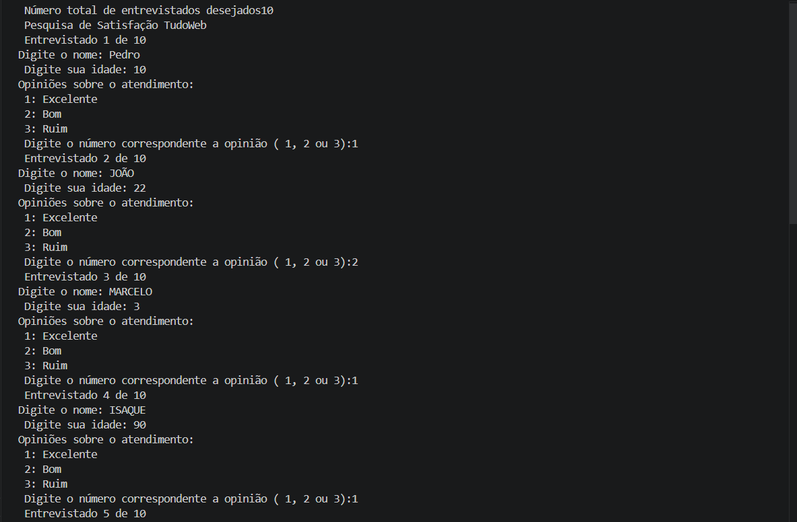
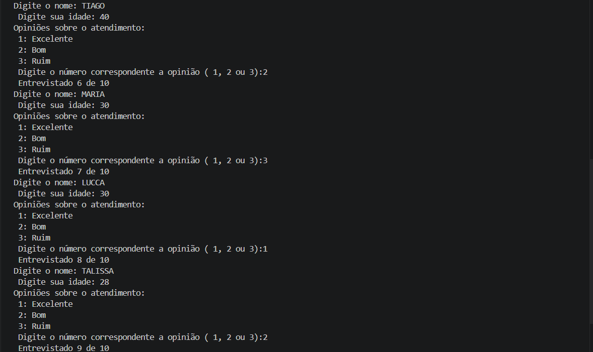
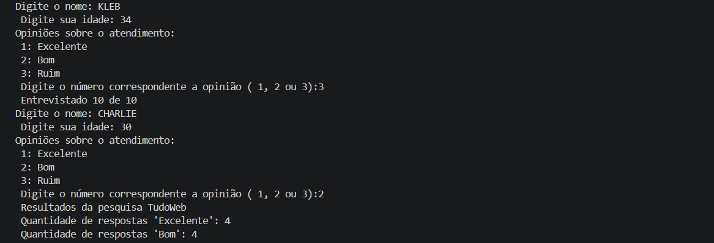

# 🔍 Pesquisa TudoWeb

Este projeto é uma ferramenta de pesquisa de satisfação atravez de entrevistas.

## 🚀 Tecnologias Utilizadas
* **Python** 
* **Git & GitHub** 

## 📊 Resultados das Pesquisas
Aqui estão os prints dos 10 resultados obtidos:

> **Nota:** Os prints acima demonstram a precisão da captura de dados e o tempo de resposta da primeira versão estável.
